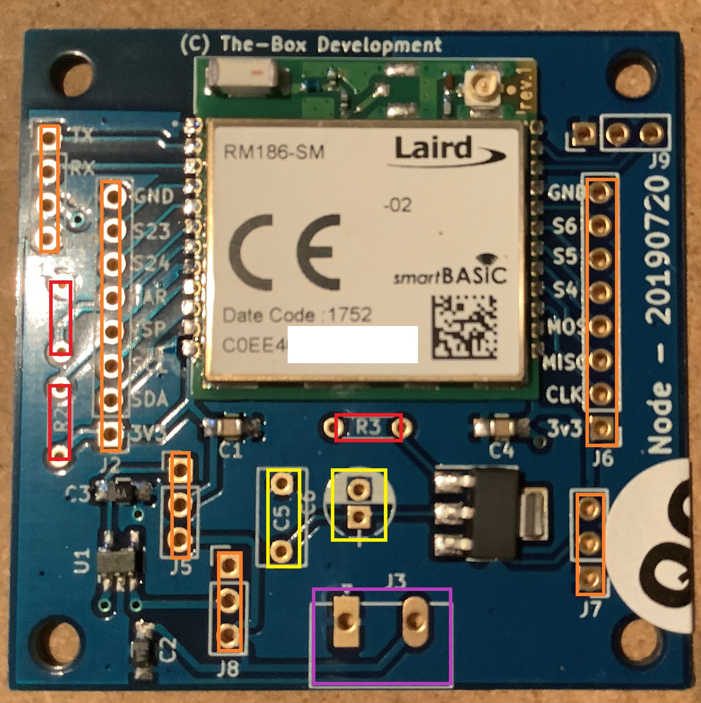

# Hardware assembleren

De hardware voor de workshop is voor een deel gereed. Alle SMD componenten zijn reeds op de PCB gesoldeerd en de RM186 module is getest en van de laatste firmware voorzien. Alle 'bedrade' componenten moeten nog op de PCB gesoldeerd worden.
Alle componenten, de PCB en het gebruikte soldeer voldoen aan de RoHS richtlijnen.

Om het solderen van de componenten te vereenvoudigen kun je voor eigen gebruik lood houdend soldeer gebruiken. Dit heeft een lager smeltpunt dan de meeste loodvrije soldeer en is makkelijker te verwerken.

## Voorbereidingen
Als voorbereiding op het solderen moeten eerst de connectoren (pin headers) op maat gemaakt worden. Bij de verstrekte onderdelen zit een strip van 40 pinnen, deze moet onderverdeeld worden in:
- 2 x 8 pinnen
- 3 x 3 pinnen
- 1 x 4 pinnen

De strip kan simpel gebroken worden tussen twee pinnen waar het plastic dunner is.

## Solderen
Op onderstaande foto is met kleuren aangegeven welke onderdelen waar moeten komen.

Houdt bij het solderen de volgende volgorde aan:
1. De 3 weerstanden (rood)
1. De twee 8 polige pin strips (oranje)
1. De 4 polige strip (oranje)
1. De drie 3 polige strips. **let op de posities** (oranje)
1. De condensatoren, let bij het 'ronde' exemplaar op de plus en min. (geel)
1. De schroefconnector met de openingen naar de rand van de PCB. (paars)

Vraag eventueel om hulp aan deelnemers met meer ervaring met solderen.

## Antenne
Sluit als laatste de antenne aan op de node.

De node is nu (bijna) gereed voor gebruik.
